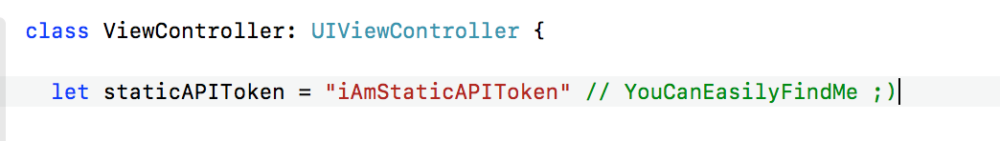
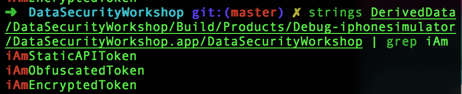
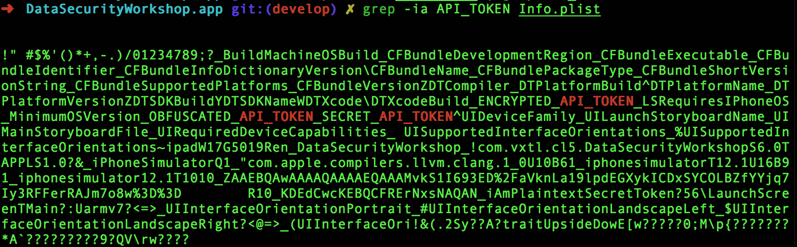
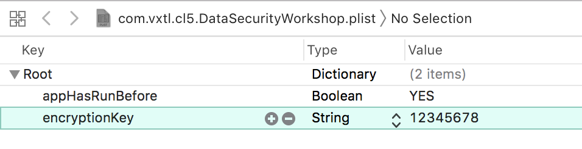
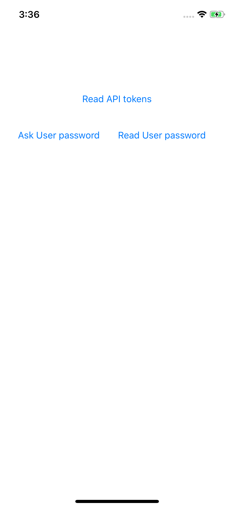

# iOS data security basics

## Project requirements

Swift 4.2, Xcode 10.1

## What is this all about?

iOS data security basics: key management, workshop for [iOS Con UK](https://skillsmatter.com/conferences/10823-ioscon-2019-the-conference-for-ios-and-swift-developers#program).

iOS app security has many shades: starting from protecting on-screen data from screenshots by iOS itself, network security, key management, data encryption, yada yada.

These processes are built around protecting sensitive data and access: from the points where it appears to the point where it's not needed anymore (or sent from iOS app to another service). Look for useful materials (talks, posts) to the [Links](#links) section at the bottom.

Today we will pay attention at key management: what are keys and how to store them. 

## What are keys?

There are many different things that we can name a "key" talking about iOS application:

- **pre-defined keys**, like API tokens or TLS cerificates, that are hardcoded into the app before it pushing to the AppStore. Revealing API tokens might be innocent or might lead to $$$ bils from Amazon services, depends. These keys are usually stored in plist files, or as separate files, or as in-code variables.

- **runtime keys**, like session tokens or user passwords: sensitive bits that app receives in runtime. Such keys are typically places to User Defaults or Keychain.

- **encryption keys** can include passphrase, key material (key, IV, salt), private/public keys, yada yada. Depending on the scope, encryption keys can be hardcoded or generated/received during runtime.

## Encryption

In this workshop we will use only [symmetric encryption](https://en.wikipedia.org/wiki/Symmetric-key_algorithm) to encrypt data: use the same encryption key to encrypt and decrypt sensitive bits.

*Encrypting message:*

1. Generate a secret key (SK). Keep it in a secure place! Use KDF to make secret key stronger.
2. Get message and encrypt it using SK and symmetric cipher. Result of encryption is binary data.
3. For safe transfer via network encode binary to base64 with percent encoding.

*Decrypting message:*
  
1. Retrieve secret key (SK).
2. Decode encrypted string from base64 and remove percent encoding.
3. Decrypt binary data using SK and symmetric cipher.
4. Use decrypted string.

### What is KDF

KDF is a [key derivation function](https://en.wikipedia.org/wiki/Key_derivation_function) (aka key stretching function), in a simple words, KDF accepts passphrase/password and turns them into cryptographically strong key to be used during encryption/decryption.

In this project we use [Themis library](https://github.com/cossacklabs/themis), which has built-in KDF function, so we can use simple passwords for encryption-decryption (under the hood Themis handles all the cryptographic details, like using KDF, generating salt and IV).

However, without Themis you should [generate strong cryptographic keys](https://developer.apple.com/documentation/security/certificate_key_and_trust_services/keys/storing_keys_in_the_secure_enclave) before encryption/decryption.

If you use RNCryptor or CryptoSwift – [it's up to you to handle KDF, IV, salt](https://swifting.io/blog/2017/01/16/33-security-implement-your-own-encryption-schema/).

If you are not a cryptographer – use "boring" libraries, like [Themis](https://github.com/cossacklabs/themis), or [libsodium](https://github.com/jedisct1/swift-sodium).

## Protecting pre-defined keys

### 1. You can store API tokens as static variables:



But all these keys are available for anyone that has access to the app and runs `strings` command:



⚠️ Avoid storing API tokens as static variables.


### 2.1 You can store API tokens in `Info.plist` (or as separate files) in plaintext

Files are part of application bundle, so if anyone has access to the .ipa, they can see any entries in `Info.plist`



⚠️ Avoid storing API tokens as plaintext in files.

### 2.2 You can store API tokens obfuscated

Storing tokens obfuscated in a good idea if these tokens are not sensitive. Developers should obfuscate tokens and place them into file. On start, app de-obfuscated them.


Obfuscate tokens in advance:

```swift
// takes secret string, obfuscates and retuns base64-string
func obfuscateAPIKey(fromString: String) -> String? {
  let obfuscator = Obfuscator()
  let obfuscatedArray: [UInt8] = obfuscator.bytesByObfuscatingString(string: fromString)
  let obfuscatedData = Data(bytes: obfuscatedArray, count: obfuscatedArray.count)
  let key = Key(data: obfuscatedData).base64String
  return key
}
```

De-obfuscated on start:

```swift
// reads from plist, de-obfuscates, returns Key
func readObfuscatedKeyFromPlist() -> Key? {
  let obfuscatedFromPlist = Bundle().getString(inPlist: EncryptionEngine.InfoPlistName, for: EncryptionEngine.obfuscatedAPITokenKey)
  
  // decode from base64 to EncryptedData
  guard let dataFromPlist = EncryptedData.init(base64String: obfuscatedFromPlist) else {
    return nil
  }
  // EncryptedData -> [UInt8]
  let byteArray = [UInt8](dataFromPlist.data)
  
  // deobfuscate
  let obfuscator = Obfuscator()
  let deobfuscatedString = obfuscator.reveal(key: byteArray)
  
  return Key(string: deobfuscatedString)
}
```

Obfuscation just add one extra step, but if attacker found the principle of obfuscation, string can be de-obfuscated. 


⚠️ Avoid storing sensitive API tokens as obfuscated in files.


### 2.3 You can store API tokens encrypted

Storing tokens encrypted is rather secure, encryption key can be generated "on the fly" during the app run. Developers prepare encrypted keys and place them into file. On start, app decrypts them:

Encrypt tokens in advance:

```swift
// takes secret string, encrypts, returns base64 string
func encryptAPIKey(fromString: String) -> String? {
  // generate encryption key
  let encryptionKey = generateTempKey()
  do {
    // encrypt string into EncryptedData
    let encryptedKey = try encryptMessage(message: fromString, secretKey: encryptionKey)
    return encryptedKey.base64String
  } catch {}
  
  return nil
}
```

Decrypting on start:

```swift
// reads from plist, decrypts, returns Key
func readEncryptedKeyFromPlist() -> Key? {
  // read base64
  let base64FromPlist = Bundle().getString(inPlist: EncryptionEngine.InfoPlistName, for: EncryptionEngine.encryptedAPITokenKey)
  
  // transform base64 string into Data
  guard let dataFromPlist = EncryptedData.init(base64String: base64FromPlist) else {
    return nil
  }
  
  // generate decryption key
  let decryptionKey = generateTempKey()
  do {
    // decrypt key from plist
    let decryptedStringFromPlist = try decryptMessage(encryptedMessage: dataFromPlist, secretKey: decryptionKey)
    return Key(string: decryptedStringFromPlist)
  } catch {}
  
  return nil
}
```

Example how to generate encryption passphrase. Such passphrase should be temporary, do not store it, do not assign to constant variable in memory:

```swift
private func generateTempKey() -> Key {
  var key = "some "
  key += String(115)
  key += String(101)
  key += String(99)
  key += String(114)
  key += String(101)
  key += String(116)
  return Key(string: key)!
}
```

Remember to use KDF if you don't use Themis.

## Protecting user-defined keys

### 1. Assigning to the memory variable

Good enough on non-jailbroken devices: iOS sandbox should protect app's memory from prying eyes. However it's better to minimize amount of time variable is placed in memory, and to use more secure storages.

### 2. Saving to the User Defaults / database

Well-well, everyone knows how to put data to User Defaults (CoreData, Realm, sqllite), but don't store sensitive data there!

Reading User Defaults is as simple as this:

```swift
let path = NSSearchPathForDirectoriesInDomains(.libraryDirectory, .userDomainMask, true)
let folder = path[0]
print("Your NSUserDefaults are stored in this folder: \(folder)/Preferences")
```

Resulting path is similar to `/Users/<user name>/Library/Developer/CoreSimulator/Devices/<device id>/data/Containers/Data/Application/<app id>/Library/Preferences`.

Our super-secret key in shown in User Defaults:



Results are the same if you store keys in any non-encrypted database.

### 3. Saving to the Keychain

Save password to the Keychain and setup security options like "access only when device is unlocked", "access only at this device", "access protected by biometrics"

Saving is quite easy (especially when you use some Keychain wrappers, like [Valet](https://github.com/square/Valet)):

```swift
func saveEncryptionKeyToKeychain(key: Key) {
  let myValet = Valet.valet(with: Identifier(nonEmpty: EncryptionEngine.valetID)!, accessibility: .whenUnlocked)
  myValet.set(object: key.data, forKey: EncryptionEngine.valetKeyID)
  
  // remember in User Defaults
  rememberAppHasRun()
}
```

Reading is aslo quite easy:

```swift
func readEncryptionKeyFromKeychain() -> Key? {
  let myValet = Valet.valet(with: Identifier(nonEmpty: EncryptionEngine.valetID)!, accessibility: .whenUnlocked)
  if let readObject = myValet.object(forKey: EncryptionEngine.valetKeyID) {
    
    // if first run, then key is left from previous installation, should remove
    if (isAppFirstRun()) {
      print("The Keychain is stored from previous app launch, do not read key")
      return nil
    }
    
    return Key(data: readObject)
  }
  return nil
}
```

However, there's a trick: when an application is uninstalled, the Keychain data used by the application can be retained by the device, unlike the data stored by the application sandbox which is wiped. If user sells their device without performing a factory reset, the buyer of the device may be able to gain access to the previous user's application accounts and data by reinstalling the same applications used by the previous user. This would require no technical ability to perform.

When an application is first launched after installation, it's wise to wipe all Keychain data associated with the application. 

How to determine if app is running first time? Store some flag like “hasAlreadyLaunched” in UserDefaults.
On launch – check if “hasAlreadyLaunched” key is present, if no – it’s a first time launch. Clean up Keychain and add “hasAlreadyLaunched” key to UserDefaults.


## Implementation details

In our example we will use [Themis Secure Cell](https://github.com/cossacklabs/themis/wiki/Secure-Cell-cryptosystem) for encryption. It has pre-built KDF, and uses AES-256-GCM. Data will be encrypted and appended by auth tag, saving it from tampering.

*Cryptographic details are hidden in SecureCell object:*

```swift
// 1. create encryptor SecureCell with own secret key
let cellSeal = TSCellSeal(key: secretKey.data)

// 2. encrypt data
do {
  var encryptedMessage = try cellSeal.wrap(message.data(using: .utf8)!,
                                           context: nil)
  
} catch { }

// 3. decrypt data
do {
  var decryptedMessage = try cellSeal.unwrapData(encryptedMessage.data,
                                                 context: nil)
  var decryptedString = decryptedMessage.utf8String                                             
} catch { }
```

See `EncryptionEngine+ProtectData.swift`.


## Exercises




Check for `TODO:` in code.

### 1. Read API tokens

Read API token to get all API tokens from `Info.plist` – plaintext, obfuscated and encrypted

### 2. Save user password to Keychain

Instead of saving to User Defaults, save user password to Keychain, and read it from Keychain.

### 3. Check if application is running for the first time, but it has a password in Keychain

Add separate check if application is running for the first time, but there's some password in Keychain – ignore it and wipe it.


## Next steps

Security is never done. Check following important steps for your applications:

1. Secure Enclave. When storing in Keychain, to use the key, you must briefly copy a plain-text version of it into system memory. As an added layer of protection, you can store a private key in the [Secure Enclave](https://developer.apple.com/documentation/security/certificate_key_and_trust_services/keys/storing_keys_in_the_secure_enclave).

2. Hide sensitive data: put overlay view instead of system screenshot during app switching.

	* Add view on `applicationDidEnterBackground`.
	* Remove view on `applicationDidBecomeActive`.

3. Monitor 3rd party dependencies for vulnerabilities and critical bugs:

	* https://www.whitesourcesoftware.com/
	* https://www.blackducksoftware.com/
	* https://snyk.io/

4. Mobile security testing guide. See [OWASP book](https://mobile-security.gitbook.io/mobile-security-testing-guide/ios-testing-guide/0x06a-platform-overview).

## Disclaimer

This is an education project, this code shouldn't be used in production ;)

## Links

1. Even more tips and tricks about simple iOS security things we tend to forget:
https://speakerdeck.com/vixentael/x-things-you-need-to-know-before-implementing-cryptography

2. Popular note-taking apps share these security flaws:
https://medium.com/@vixentael/popular-note-taking-apps-share-these-security-flaws-security-tips-for-developers-326180e41329

3. Building end-to-end encryption schemes, workshop and talks:
https://github.com/vixentael/zka-example


## Stay tuned

Wanna help with data security and encryption? Not sure if your app is secure? Already have a large project, but no security engineers? Ping [@cossacklabs](https://cossacklabs.com/), this is what we do for living :)

More talks to read & watch in my repository [vixentael/my-talks](https://github.com/vixentael/my-talks).
